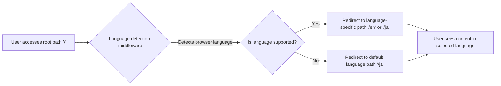

# Multi-Language Landing Page Sample with HonoX (SSG)

## Overview
This project demonstrates a multilingual landing page implementation using HonoX with Static Site Generation (SSG). It features language detection, content localization, and a responsive design - all while maintaining excellent performance through static generation.

## Tech Stack
- HonoX (SSG) - Lightweight web framework for building static sites
- TailwindCSS - Utility-first CSS framework for styling
- Cloudflare Pages - Hosting platform for deployment

## Features
- Multi-language support (For example, English and Japanese)
- Automatic language detection based on browser preferences
- Responsive design with TailwindCSS
- Static site generation for optimal performance
- Clean URL structure with language paths (/en/, /ja/)
- Language switcher component

## How it Works

Here's a user-perspective flowchart of how the application works:



- When a user accesses the root path (`/`), the application automatically redirects to a language-specific path (`/en` or `/ja`) based on the user's browser language settings
- The language detection middleware (`_middleware.ts`) determines the appropriate language using Hono's `languageDetector`
- If the detected language is not supported, the user is redirected to the default language path (Japanese `/ja`)
- All routes are dynamically generated for each supported language
- Translations are stored in JSON files (`app/lib/i18n/locales/`) and loaded based on the current language parameter
- The route structure is mirrored across languages, so `/en/about` and `/ja/about` will show the same page in different languages

## Directory Structure
```
app/
├── client.ts             # Client-side entry point for HonoX
├── server.ts             # Server-side configuration
├── global.d.ts           # TypeScript declarations
├── style.css             # Global styles
├── components/           # Reusable components
│   └── LanguageSwitcher.tsx # Language switcher component
├── islands/              # Interactive components (HonoX islands)
├── lib/                  # Utility libraries
│   ├── i18n/             # Internationalization support
│   │   ├── index.ts      # Translation utility functions
│   │   └── locales/      # Translation files
│   │       ├── en.json   # English translations
│   │       └── ja.json   # Japanese translations
│   └── utils/            # General utility functions
│       └── index.ts      # Utility functions
└── routes/               # Application routes
    ├── index.tsx         # Root route handler
    ├── _middleware.ts    # Language detection middleware
    ├── _404.tsx          # Custom 404 page
    ├── _error.tsx        # Error handling
    ├── _renderer.tsx     # Custom renderer
    ├── style.css         # Route-specific styles
    └── [lang]/           # Dynamic language routes
        ├── index/        # Landing page for each language
        └── about/        # About page for each language
```

## Getting Started
1. Clone the repository
2. Install dependencies: `pnpm install`
3. Run the development server: `pnpm dev`
4. Build for production: `pnpm build`

## Adding a New Language
1. Add the language code to the supported languages array in `app/lib/i18n/index.ts`
2. Create a new translation file in `app/lib/i18n/locales/[lang-code].json`
3. Add the language display name to the `displayLang` object in `app/components/LanguageSwitcher.tsx`

## Deployment
This project is configured for deployment on Cloudflare Pages. Connect your repository to Cloudflare Pages and configure the build settings as follows:
- Build command: `pnpm run build`
- Build output directory: `dist`

## Note
- PostCSS is required to apply TailwindCSS for HonoX (SSG).
